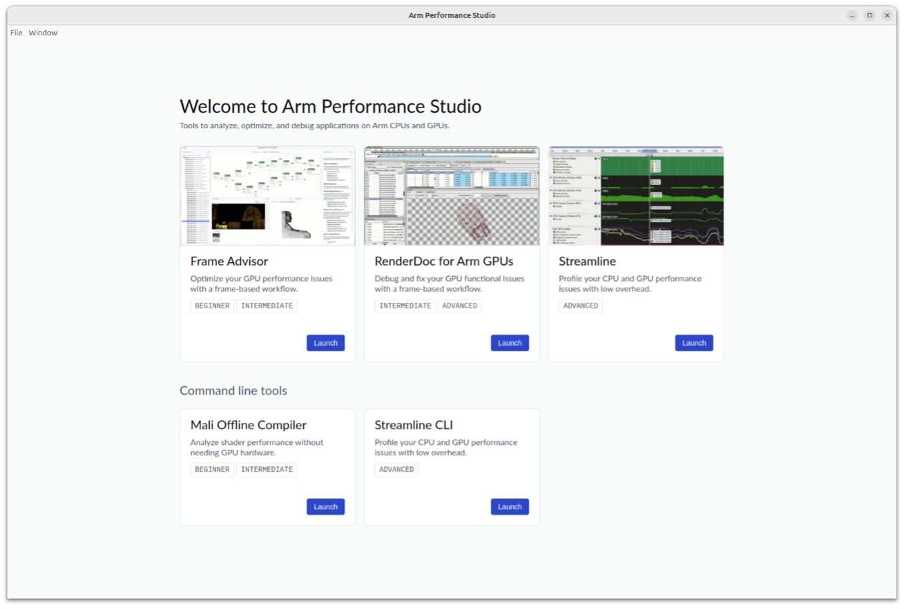
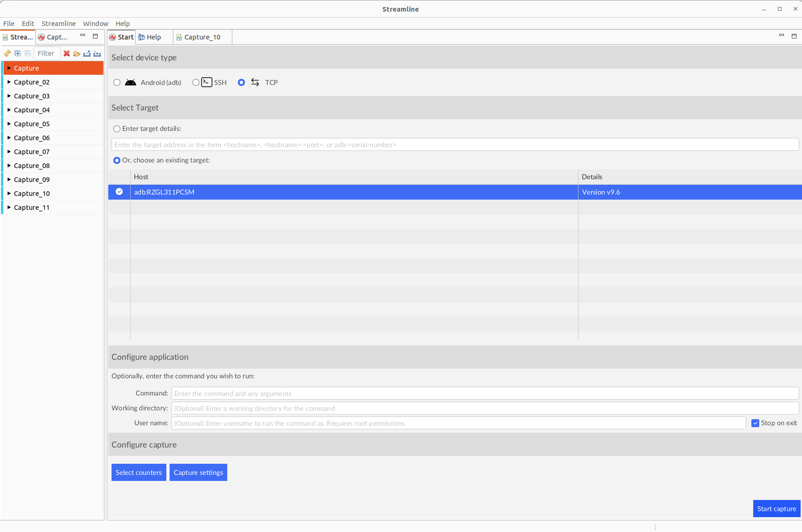
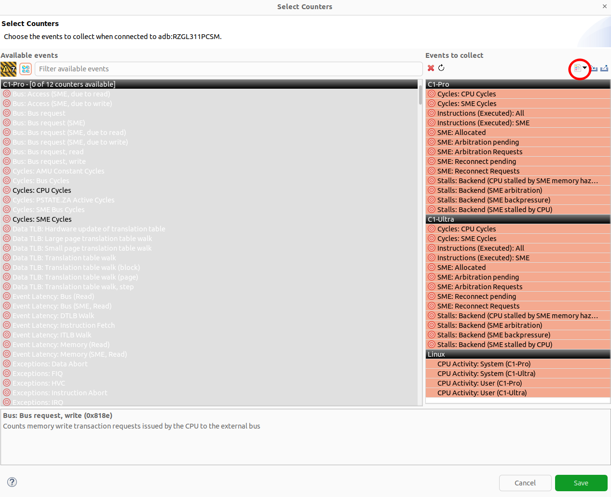
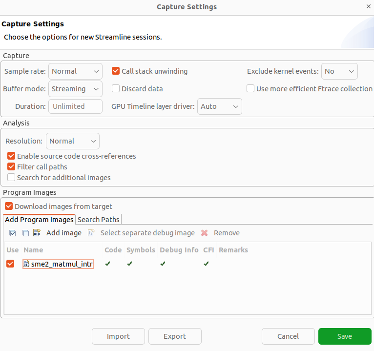

## Arm Performance Studio

[Arm Performance Studio](https://developer.arm.com/Tools%20and%20Software/Arm%20Performance%20Studio) is a performance analysis tool suite for developers to performance test their applications on devices with Arm CPUs. You can use
[Streamline](https://developer.arm.com/Tools%20and%20Software/Streamline%20Performance%20Analyzer) to capture a performance profile that shows all the performance counter activity from the device. Generate an easy-to-read performance summary from an annotated Streamline capture, and get actionable advice about where you should optimize.
## Download and Install Arm Performance Studio

Arm Performance Studio is supported on Windows, Linux, and macOS hosts. Get the [Arm Performance Studio installation package](https://developer.arm.com/Tools%20and%20Software/Arm%20Performance%20Studio#Downloads).

Refer to the [Arm Performance Studio install guide](/install-guides/ams/) for installation instructions.

## Launch the tools

To open the tools, launch the Performance Studio Hub:

- On Windows, search for Performance Studio.
- On macOS and Linux, open the Performance Studio application file from the install directory.



## Phone Setup

Note - project updated with extra flags for cmake build, build it with extra flags for architecture:

```bash
cmake -G Ninja  -S . -B build-android -DCMAKE_BUILD_TYPE:STRING=Release -DCMAKE_TOOLCHAIN_FILE:STRING="$NDK/build/cmake/android.toolchain.cmake" -DANDROID_ABI:STRING=arm64-v8a -DANDROID_PLATFORM:STRING=android-24 -DANDROID_STL:STRING=c++_static -DSME2_MARCH="-march=armv9-a+sme2" -DSME2_ASM_MARCH="-march=armv9-a+sme2"
cmake --build build-ninja
```

updated flags in cmake project:
```
#set(CMAKE_C_FLAGS_RELEASE "-Wall -O2 -DNDEBUG" CACHE STRING "" FORCE)
set(CMAKE_C_FLAGS_RELEASE "-O2 -g -fno-omit-frame-pointer -fno-lto" CACHE STRING "" FORCE)
set(CMAKE_C_FLAGS_DEBUG "-Wall -g -DDEBUG" CACHE STRING "" FORCE)
#set(CMAKE_ASM_FLAGS_RELEASE "-Wall -O2" CACHE STRING "" FORCE)
set(CMAKE_ASM_FLAGS_RELEASE "-O2 -g -fno-omit-frame-pointer -fno-lto" CACHE STRING "" FORCE)
set(CMAKE_ASM_FLAGS_DEBUG "-Wall -g" CACHE STRING "" FORCE)
```

Arm Streamline Performance Analyzer
Version 9.7.1, Build 20250908_134106

m1s:/data/local/tmp $ ./sme2_matmul_intr 1000 70 80 90                                                                                                                                    
SME2 Matrix Multiply fp32 *intr* [benchmarking mode, 1000 iterations] with M=70, K=80, N=90
Reference implementation: min time = 169 us, max time = 677 us, avg time = 196.14 us
SME2 implementation *intr*: min time = 7 us, max time = 47 us, avg time = 8.00 us
m1s:/data/local/tmp $ 


m1s:/data/local/tmp $ ./sme2_matmul_intr 3000 70 80 90                                                                                                                                    
SME2 Matrix Multiply fp32 *intr* [benchmarking mode, 3000 iterations] with M=70, K=80, N=90
Reference implementation: min time = 169 us, max time = 830 us, avg time = 187.17 us
SME2 implementation *intr*: min time = 7 us, max time = 40 us, avg time = 7.85 us


You already have the built examples on the phone, now you can copy the `gatord` binary from your Arm Performance Studio installation to your android device:

```sh
adb push <Arm_Performance_Studio_install_path>/streamline/bin/android/arm64/gatord /data/local/tmp/
```

Start the gator daemon on your android device and point to the benchmarking executable you profile, `--wait-process` flag will ensure you can start the gator daemon and wait for a process matching the specified command to launch before starting capture:

```bash
adb shell
cd /data/local/tmp
./gatord --allow-command --wait-process sme2_matmul_intr
```


In Streamline tool, you can use the following to configure the capture:
1. Select TCP target and ensure there's an existing target available
2. Use select counters button to select the counters you would like to see in the Streamline capture
3. Use capture settings button to add more information to your capture




Add counters from a template with the button shown below, select `SME2 Basic Utilization` and save:



In Capture Settings, add previously built libraries from `build/lib/` and executables from `build/bin/` to get a more detailed analysis:



You can now click `Start Capture` in Streamline and click `Save` which opens up a Capture file and waits for the process.

On your target device, run the executable in ADB shell, providing the path to libraries and the number of iterations to benchmark:

